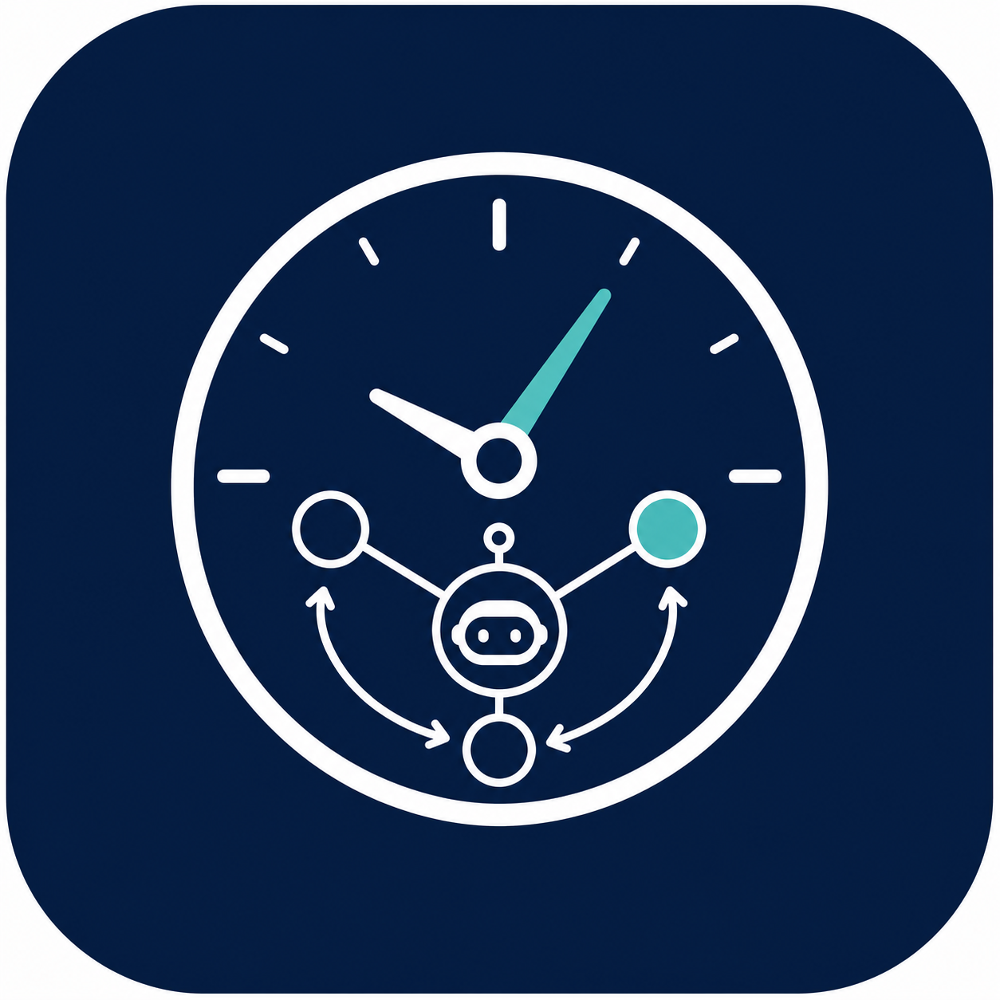

<p align="center">
  
</p>

<h1 align="center">Timely Machine</h1>

<p align="center">
  <strong>Awareness of Time Makes Test-Time Scaling Agentic</strong>
</p>

<p align="center">
  Official code release, including the evaluation framework and the RL training code.
</p>

<p align="center">
  <a href="https://arxiv.org/abs/2601.16486">📄 Paper</a> ·
  <a href="README_CN.md">🌐 中文说明</a> ·
  <a href="src/timely_eval">📊 Eval Package</a> ·
  <a href="rl/internbootcamp_v2">🏋️ RL Code</a> ·
  <a href="rl/internbootcamp_v2/README.md">📘 RL README</a>
</p>

<p align="center">
  
  
  
  
</p>

## Highlights

Large language models increasingly rely on test-time scaling for complex reasoning, but agentic workflows break the traditional generation-length view of test-time because tool latency decouples wall-clock time from generated tokens. **Timely Machine** redefines test-time scaling around wall-clock time and studies whether agents can adapt their strategies under explicit time budgets.

We introduce **Timely-Eval**, covering high-frequency tool calls, low-frequency tool calls, and time-constrained reasoning. By varying tool latency, we observe that smaller models benefit more from fast feedback and frequent interaction, while larger models dominate high-latency settings through stronger interaction quality. Since existing models struggle to adapt reasoning to time budgets, we further propose **Timely-RL**, a cold-start SFT plus reinforcement learning recipe that improves temporal planning and boosts performance across Timely-Eval.

## What's New

- **2026.06** Initial open-source release with Timely Eval, Timely RL, toy examples, tests, and smoke-tested launch notes.
- **2026.06** README split into English and Chinese versions.
- **2026.06** Eval and RL code paths are separated in documentation and runtime setup.

## Choose Your Path

This repository has two intentionally separate parts. Use **Timely Eval** if you want to reproduce evaluation. Use **Timely RL** if you want to train timer-aware agents.

<table>
  <tr>
    <td width="50%">
      <h3>📊 Timely Eval</h3>
      <p><strong>Use this for evaluation.</strong></p>
      <p>Installable package and CLI for General Reasoning, Agentic ML, and Interactive Jericho evaluation.</p>
      <p><code>src/timely_eval/</code><br><code>timely-eval ...</code></p>
      <p><a href="#timely-eval">Eval quick start</a></p>
    </td>
    <td width="50%">
      <h3>🏋️ Timely RL</h3>
      <p><strong>Use this for training.</strong></p>
      <p>Training code, local environment servers, distributed tool backend, and verl-based RL pipeline.</p>
      <p><code>rl/internbootcamp_v2/</code><br><code>scripts/run_llm_timer_rl_example.sh</code></p>
      <p><a href="#timely-rl">RL quick start</a></p>
    </td>
  </tr>
</table>

<a id="timely-eval"></a>

## 📊 Timely Eval: Evaluation Suite

Timely Eval is the lightweight, installable evaluation package in this release. It supports OpenAI-compatible API endpoints, including local vLLM/SGLang servers.

| Evaluation Track | Command | Required Assets |
| --- | --- | --- |
| General Reasoning | `timely-eval general` | JSONL questions and answers. |
| Agentic ML | `timely-eval agentic-ml` | Public train/test CSVs, private labels, prompt template. |
| Interactive Jericho | `timely-eval interactive` | Local Jericho/Frotz game file, e.g. `zork1.z5`. |

Interactive games time-performance experiment:

<p align="center">
  
</p>

PDF version: [picture_time_performance_acl.pdf](assets/picture_time_performance_acl.pdf)

<a id="timely-rl"></a>

## 🏋️ Timely RL: Training Pipeline

Timely RL is the training-side code. It is heavier than the eval package and has separate dependencies, runtime services, and launch scripts.

<p align="center">
  
</p>

The main RL entrypoint is:

```text
rl/internbootcamp_v2/internbootcamp/bootcamps/Basic_LLM_timer
```

Typical RL launch order:

1. Start one task environment server: general timer, Agentic ML timer, or Jericho.
2. Start the distributed tool backend with `scripts/run_llm_timer_tool_server.sh`.
3. Start training with `scripts/run_llm_timer_rl_example.sh`.

See [rl/internbootcamp_v2/README.md](rl/internbootcamp_v2/README.md) for RL-specific setup and smoke-test notes.

## Repository Structure

```text
src/timely_eval/                 # Timely Eval package and CLI
examples/                        # Synthetic toy data and prompts for smoke tests
tests/                           # Unit tests for eval utilities
rl/internbootcamp_v2/            # Timely RL training code and local verl stack
rl/internbootcamp_v2/README.md   # RL-specific setup and launch notes
assets/                          # README figures and paper assets
```

## Setup

Install Timely Eval:

```bash
cd OpenSource
python -m venv .venv
source .venv/bin/activate
pip install -e ".[agentic,dev]"
```

Install optional Jericho/Frotz dependencies only for interactive-game evaluation:

```bash
pip install -e ".[interactive]"
python -m spacy download en_core_web_sm
```

Configure an OpenAI-compatible endpoint:

```bash
export OPENAI_API_KEY="your-key"
export OPENAI_BASE_URL="https://api.openai.com/v1"
```

For local model servers:

```bash
export OPENAI_API_KEY="empty"
export OPENAI_BASE_URL="http://127.0.0.1:8000/v1"
export NO_PROXY="127.0.0.1,localhost"
export no_proxy="127.0.0.1,localhost"
```

## Eval Quick Start

### General Reasoning

Input JSONL:

```json
{"id": "case-1", "question": "Compute 2 + 2.", "answer": "4"}
```

Measure baseline duration:

```bash
timely-eval general \
  --mode speed_test \
  --data-path examples/data/general_reasoning_toy.jsonl \
  --benchmark-name toy \
  --output-dir outputs/general_toy \
  --model <MODEL_NAME> \
  --workers 4
```

Evaluate under relative time budgets:

```bash
timely-eval general \
  --mode time_test_w_tool \
  --data-path examples/data/general_reasoning_toy.jsonl \
  --benchmark-name toy \
  --output-dir outputs/general_toy \
  --model <MODEL_NAME> \
  --workers 4 \
  --time-limit-probs 0.75 1.0 2.0 3.0
```

Analyze existing results:

```bash
timely-eval general \
  --mode result_analysis \
  --data-path examples/data/general_reasoning_toy.jsonl \
  --benchmark-name toy \
  --output-dir outputs/general_toy \
  --model <MODEL_NAME>
```

### Agentic ML

Agentic ML expects:

- `data_dir/public/train.csv`
- `data_dir/public/test.csv`
- a private label file for evaluation
- a prompt template that tells the agent how to produce `submission.csv`

Toy speed test:

```bash
timely-eval agentic-ml \
  --mode speed_test \
  --benchmark-name toy_ml \
  --data-dir examples/data/agentic_ml_toy \
  --private-test-path examples/data/agentic_ml_toy/private/test.csv \
  --prompt-template examples/prompts/agentic_ml_toy.txt \
  --output-dir outputs/agentic_ml_toy \
  --model <MODEL_NAME> \
  --is-binary \
  --binary-label-column label \
  --batch-size 2 \
  --workers 2
```

Full time-budgeted evaluation:

```bash
timely-eval agentic-ml \
  --mode full_eval \
  --benchmark-name toy_ml \
  --data-dir examples/data/agentic_ml_toy \
  --private-test-path examples/data/agentic_ml_toy/private/test.csv \
  --prompt-template examples/prompts/agentic_ml_toy.txt \
  --output-dir outputs/agentic_ml_toy \
  --model <MODEL_NAME> \
  --is-binary \
  --binary-label-column label \
  --time-limit-probs 1.0 2.0 3.0
```

### Interactive Jericho

Interactive evaluation requires a local game file such as `zork1.z5`.

```bash
timely-eval interactive \
  --mode speed_eval \
  --game-path /path/to/zork1.z5 \
  --output-dir outputs/interactive_zork1 \
  --model <MODEL_NAME> \
  --batch-size 4 \
  --max-test-steps 64
```

```bash
timely-eval interactive \
  --mode full_eval \
  --game-path /path/to/zork1.z5 \
  --output-dir outputs/interactive_zork1 \
  --model <MODEL_NAME> \
  --batch-size 4 \
  --max-steps 30 50 100 200
```

## RL Quick Start

The RL code is not installed by the Timely Eval setup above. Use the RL README for the full environment.

```bash
cd rl/internbootcamp_v2
less README.md
```

Smoke-test status:

| Component | Status |
| --- | --- |
| General timer server | `/health`, `/register`, and `/call` passed. |
| Agentic ML server and `MLTimerTool` | Code execution, `submission.csv` evaluation, and timing passed with external ML data. |
| Jericho server and tools | Available actions, score, max score, `look`, and end-game passed with external ROM files. |
| One-step RL smoke | Qwen3-8B completed on one H200 with actor/reference CPU offload. |

## Release Notes

This open-source release intentionally omits private or machine-specific artifacts:

- API keys, service-account files, internal IPs, and private endpoints
- experiment logs, model outputs, checkpoints, generated workspaces, private labels, large RL datasets, and internal cluster launch snapshots
- ML benchmark `data_sources`
- Jericho game ROM files

The examples in this repository are synthetic and intended for smoke tests only.

Agentic ML executes model-generated Python code as a subprocess in an isolated working directory. This is not a security sandbox. For untrusted code, run inside a container or VM with restricted filesystem and network access.

## Development

```bash
pip install -e ".[agentic,dev]"
PYTHONPATH=src pytest -q
```

Run a lightweight privacy scan before publishing:

```bash
rg -n "sk-|CREDENTIALS|BEGIN .*PRIVATE KEY|/mnt/|http://10\\.|http://100\\.|http://172\\.|http://192\\.168\\." .
```

## Citation

If you find this work helpful, please consider citing:

```bibtex
@misc{ma2026timelymachineawarenesstime,
      title={Timely Machine: Awareness of Time Makes Test-Time Scaling Agentic},
      author={Yichuan Ma and Linyang Li and Yongkang chen and Peiji Li and Xiaozhe Li and Qipeng Guo and Dahua Lin and Kai Chen},
      year={2026},
      eprint={2601.16486},
      archivePrefix={arXiv},
      primaryClass={cs.CL},
      url={https://arxiv.org/abs/2601.16486},
}
```
